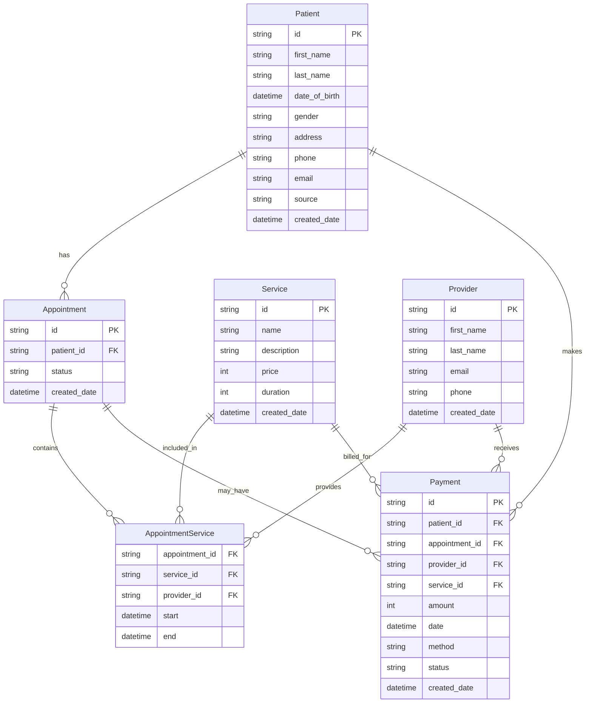

# Backend Models Documentation

This document describes the database models and their relationships for the Decoda Health system.

## Entity Relationship Diagram (ERD)

(Uses mermaid to generate the ERD.)

## Model Descriptions

### Patient

Represents a patient in the healthcare system. Patients are the primary entities that receive services through appointments.

**Fields:**

- `id` (string): Unique identifier for the patient
- `first_name` (string): Patient's first name
- `last_name` (string): Patient's last name
- `date_of_birth` (datetime): Patient's date of birth
- `gender` (string): Patient's gender - one of: "male", "female", "other"
- `address` (string): Patient's address
- `phone` (string): Patient's phone number
- `email` (string): Patient's email address
- `source` (string): How the patient found the practice - one of: "in_person", "phone", "instagram", "tiktok", "google", "website"
- `created_date` (datetime): When the patient record was created

**Relationships:**

- One-to-many with `Appointment`: A patient can have multiple appointments
- One-to-many with `Payment`: A patient can make multiple payments

---

### Appointment

Represents a scheduled appointment between a patient and healthcare providers. An appointment can contain multiple services, each potentially with different providers.

**Fields:**

- `id` (string): Unique identifier for the appointment
- `patient_id` (string): Foreign key to the Patient who has the appointment
- `status` (string): Status of the appointment - one of: "pending", "confirmed", "cancelled"
- `created_date` (datetime): When the appointment record was created

**Relationships:**

- Many-to-one with `Patient`: Each appointment belongs to one patient
- Many-to-many with `Service`: An appointment can include multiple services (through `AppointmentService`)
- One-to-many with `Payment`: An appointment may have associated payments (not all appointments have payments)

**Status Values:**

- `pending`: Appointment is scheduled but not yet confirmed
- `confirmed`: Appointment is confirmed and will proceed
- `cancelled`: Appointment has been cancelled

---

### AppointmentService

A junction table that represents the many-to-many relationship between Appointments and Services. This model allows appointments to have multiple services, each with its own provider and scheduled time slot.

**Fields:**

- `appointment_id` (string): Foreign key to the Appointment
- `service_id` (string): Foreign key to the Service being provided
- `provider_id` (string): Foreign key to the Provider delivering the service
- `start` (datetime): Scheduled start time for this service within the appointment
- `end` (datetime): Scheduled end time for this service within the appointment

**Relationships:**

- Many-to-one with `Appointment`: Links to a specific appointment
- Many-to-one with `Service`: Links to a specific service
- Many-to-one with `Provider`: Links to the provider delivering this service

**Example Use Case:**
An appointment might include a consultation (Service 1 with Provider A from 9:00-9:30), followed by a blood test (Service 2 with Provider B from 9:30-9:45), followed by an X-ray (Service 3 with Provider C from 10:00-10:15).

---

### Service

Represents a billable service that can be provided to patients. Services are the catalog of available treatments, consultations, tests, and procedures.

**Fields:**

- `id` (string): Unique identifier for the service
- `name` (string): Name of the service (e.g., "General Consultation", "Blood Test")
- `description` (string): Description of what the service entails
- `price` (int): Price in cents (e.g., $150.00 = 15000 cents)
- `duration` (int): Duration in minutes
- `created_date` (datetime): When the service record was created

**Relationships:**

- Many-to-many with `Appointment`: Services are linked to appointments through `AppointmentService`
- One-to-many with `Payment`: Payments can reference a service (typically the primary service for an appointment)

**Important Notes:**

- Prices are stored in cents to avoid floating-point precision issues
- Duration is stored in minutes for easy scheduling calculations

---

### Provider

Represents a healthcare provider (doctor, nurse, specialist, etc.) who delivers services to patients.

**Fields:**

- `id` (string): Unique identifier for the provider
- `first_name` (string): Provider's first name
- `last_name` (string): Provider's last name
- `email` (string): Provider's email address
- `phone` (string): Provider's phone number
- `created_date` (datetime): When the provider record was created

**Relationships:**

- Many-to-many with `Appointment`: Providers are linked to appointments through `AppointmentService`
- Many-to-many with `Service`: Providers can deliver different services (through `AppointmentService`)
- One-to-many with `Payment`: Providers can receive payments for services they've provided

---

### Payment

Represents a payment transaction for an appointment. Not all appointments have payments - some appointments may be unpaid.

**Fields:**

- `id` (string): Unique identifier for the payment
- `patient_id` (string): Foreign key to the Patient making the payment
- `appointment_id` (string): Foreign key to the Appointment being paid for
- `provider_id` (string): Foreign key to the Provider receiving the payment
- `service_id` (string): Foreign key to the Service (primary service for the appointment)
- `amount` (int): Amount in cents (e.g., $100.50 = 10050 cents)
- `date` (datetime): When the payment was processed/attempted
- `method` (string): Payment method - one of: "cash", "credit_card", "debit_card", "check"
- `status` (string): Payment status - one of: "pending", "paid", "failed"
- `created_date` (datetime): When the payment record was created

**Relationships:**

- Many-to-one with `Patient`: Each payment is made by one patient
- Many-to-one with `Appointment`: Each payment is associated with one appointment (optional - not all appointments have payments)
- Many-to-one with `Provider`: Each payment is received by one provider
- Many-to-one with `Service`: Each payment references one service (typically the primary service)

**Important Notes:**

- Amounts are stored in cents to avoid floating-point precision issues
- The `service_id` refers to the primary service for the appointment
- Payment status indicates whether the transaction was successful, pending, or failed
- Credit card payments are the most common payment method

---

## Relationship Summary

1. **Patient → Appointment**: One-to-many (a patient can have many appointments)
2. **Patient → Payment**: One-to-many (a patient can make many payments)
3. **Appointment → AppointmentService**: One-to-many (an appointment can have multiple services)
4. **Service → AppointmentService**: One-to-many (a service can be in multiple appointments)
5. **Provider → AppointmentService**: One-to-many (a provider can deliver services in multiple appointments)
6. **Appointment → Payment**: One-to-many, optional (an appointment may have payments)
7. **Provider → Payment**: One-to-many (a provider can receive multiple payments)
8. **Service → Payment**: One-to-many (a service can be paid for multiple times)

## Data Types

- **Monetary Values**: All prices and payment amounts are stored as integers representing cents (e.g., $100.50 = 10050)
- **Time Values**: All durations are stored in minutes
- **Date/Time**: All timestamps use the `datetime` type
- **Enumerated Values**: Several fields use `Literal` types to restrict values to specific options
